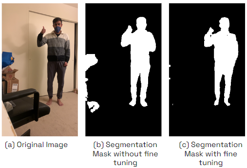
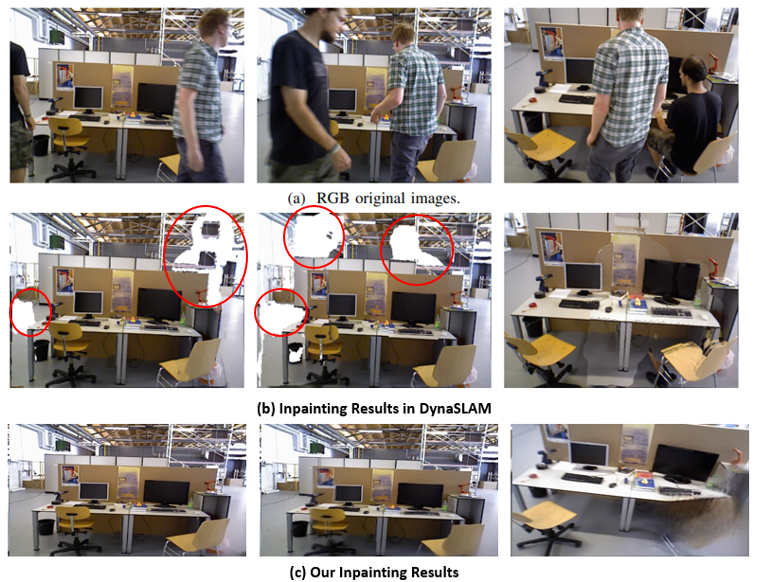

# Dynamic-Object-Removal-and-Inpainting
A Visual SLAM system improved with Dynamic object removal and inpainting the scene. 

The project aims to segment dynamic objects in the video, remove them  from the frames, and further inpaint these frames with background as we don’t want dynamic objects to be used for camera localization and to be included in the final reconstructed map of the scene.This project focuses on two major aspects, Dynamic Object Segmentation and Video Inpainting. The Project tries to improve the SLAM system with efficient and accurate learning based methods built upon the baseline DynaSLAM- [https://github.com/BertaBescos/DynaSLAM](https://github.com/BertaBescos/DynaSLAM).

The Project is divided into two phases:
1. Dynamic Object Detection and Semantic Segmentation
2. Video Inpainting

## Dynamic Object Detection and Semantic Segmentation

To achieve the dynamic object detection on certain dynamic object classes such as Humans, Birds etc. we fine tune a pre trained Transformer model called Segmenter building upon the baseline code ([Source Code](https://github.com/rstrudel/segmenter)). 

**Install** the environment according to above source and place the segmenter folder in the directory where the below notebooks are run. Also, please refer to instructions inside the ipynb files for the config files need to be replaced with source configs before performing transfer learning

The Integrated Code Implementation done to achieve this task can be accessed through [Jupyter Notebook](sem_seg_trans.ipynb).

Also, the Loss Curves and Precision Curves are inferred for different datasets when fine tuned the pre trained Model. The Source Notebook Can be found [here](Transfer_Learning.ipynb)

#### Object Detection Results:

The Segmentation Results Before and After Fine Tuning:

## Video Inpainting

To improve the Background reconstruction quality after dynamic object removal upon the exisiting implementation of DynaSLAM we use Inpainting Technique called ProPainter building upon the baseline code ([Source Code](https://github.com/sczhou/ProPainter)).

The Integrated Code Implementation done to achieve this task can be accessed through [Jupyter Notebook](/Dynamic-Object-Removal-and-Inpainting/sem_seg_trans.ipynb).

Also, the Loss Curves and Precision Curves are inferred for different datasets when fine tuned the pre trained Model. The Source Notebook Can be found [here](/Dynamic-Object-Removal-and-Inpainting/Graphs.ipynb)

#### Video Inpainting Results Results:

The Video Inpainting Results of an Image Compared with DynaSLAM:

The Video result inferred on custom dataset:

## Acknowledgements:
We would like to acknowledge and refer the works below for building on our baseline code
1. DynaSLAM: Tracking, Mapping, and Inpainting in Dynamic Scenes by Berta Bescos and Jose M. Facil and Javier Civera and Jose Neira ([Source](https://github.com/BertaBescos/DynaSLAM))
2. Segmenter: Transformer for Semantic Segmentation by Strudel, Robin and Garcia, Ricardo and Laptev, Ivan and Schmid, Cordelia ([Source](https://github.com/rstrudel/segmenter))
3. ProPainter: Improving Propagation and Transformer for Video Inpainting by Shangchen Zhou and Chongyi Li and Kelvin C. K. Chan and Chen Change Loy ([Source](https://github.com/sczhou/ProPainter))
